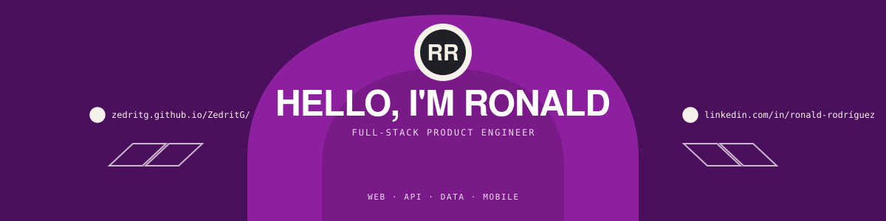

  <picture>
    <source media="(max-width: 600px)" srcset="./assets/hero-mobile.svg" />
    
  </picture>
    
  <strong>
    <a href="https://zedritg.github.io/ZedritG/">Open the interactive profile ↗</a>
  </strong>
  &nbsp;·&nbsp;
  <a href="https://www.linkedin.com/in/ronald-rodr%C3%ADguez-144842276/">LinkedIn</a>
  &nbsp;·&nbsp;
  <a href="https://github.com/ZedritG?tab=repositories">Repositories</a>
   
  English / Español

## I build the whole product path

I work where a real operational problem has to become a dependable product:
from the workflow and interface to the API, data model, deployment, and mobile
experience. My stack changes with the problem; clarity and reliability do not.

### Gym Strike — operations platform for gyms

Memberships, payments, point of sale, inventory, cash closing, audit trails,
and reporting designed as one coherent product.

`Vue` `TypeScript` `Express` `PostgreSQL` `Drizzle`

Private product · Active development

### KtrApp — real-time web, API, and mobile system

A Flutter client and NestJS backend sharing dependable contracts,
PostgreSQL/Redis infrastructure, deployment, and product behavior.

`NestJS` `Prisma` `PostgreSQL` `Redis` `Flutter`

Private product · Active development

## Public work

### Revec QR · [View repository →](https://github.com/ZedritG/Revac_Qr)

A field-visit product built around QR scanning, geolocation, roles, and offline
persistence—the details that matter once software leaves the desk and enters
the real world.

### Role-Based Access · [View repository →](https://github.com/ZedritG/Login_Application)

Authentication and product permissions translated into the navigation,
responsibilities, metrics, and controls each role actually needs.

## Product stack

`Vue` · `TypeScript` · `NestJS` · `Node.js` · `PostgreSQL` · `Redis` · `Flutter` · `Docker`

  
<strong>How I approach the work</strong>

   

  1. **Understand** the real workflow, users, constraints, and failure points.
  2. **Define** clear product, data, and API boundaries.
  3. **Build** interface, backend, infrastructure, and field behavior together.
  4. **Prove** the result with tests, builds, screenshots, and decisions.

---

  <strong>Have an operational problem worth turning into a clear product?</strong>
    
  <a href="https://www.linkedin.com/in/ronald-rodr%C3%ADguez-144842276/">Let’s talk on LinkedIn</a>
  &nbsp;·&nbsp;
  <a href="https://zedritg.github.io/ZedritG/">Explore the interactive profile</a>

