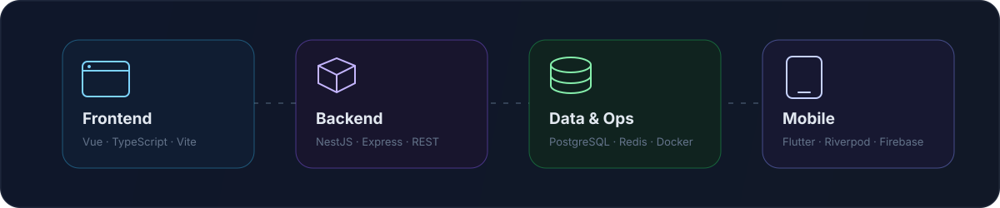
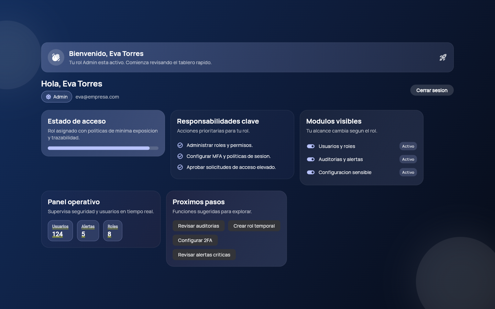

  

 

I design and build digital products end to end: interfaces people understand,
APIs teams can evolve, data layers they can trust, and mobile experiences that
work in the real world.

My work sits at the intersection of **product thinking**, **software
architecture**, and **visual craft**. I care about the full path from a business
workflow to a reliable, polished experience.

  
  

## Product spectrum

  

| Layer | Tools I use |
| --- | --- |
| **Frontend** | Vue, TypeScript, Vite, Tailwind CSS, responsive product UI |
| **Backend** | Node.js, NestJS, Express, REST APIs, WebSockets, validation |
| **Data & delivery** | PostgreSQL, Redis, Prisma, Drizzle ORM, Docker, CI/CD |
| **Mobile** | Flutter, Dart, Riverpod, Firebase, offline-first workflows |

## Product systems in development

<table>
  <tr>
    <td width="50%" valign="top">
      <h3>KtrApp</h3>
      

        A multi-surface product platform combining a NestJS API,
        PostgreSQL/Redis infrastructure, real-time capabilities, deployment
        automation, and a Flutter client.
      

      
<code>NestJS</code> <code>Prisma</code> <code>PostgreSQL</code> <code>Redis</code> <code>Flutter</code>

      Private product · Active development
    </td>
    <td width="50%" valign="top">
      <h3>Gym Strike</h3>
      

        A full-stack operations platform for memberships, payments, point of
        sale, inventory, cash closing, audit, and business reporting.
      

      
<code>Vue</code> <code>TypeScript</code> <code>Express</code> <code>PostgreSQL</code> <code>Drizzle</code>

      Private product · Active development
    </td>
  </tr>
</table>

## Selected public work

<table>
  <tr>
    <td width="50%" valign="top">
      
      <h3>Revec QR</h3>
      

        Offline-first field visit tracking with QR/barcode scanning,
        geolocation, role-aware workflows, and local persistence.
      

      
<code>Flutter</code> <code>Riverpod</code> <code>Hive</code> <code>Geolocation</code>

      <a href="https://github.com/ZedritG/Revac_Qr"><strong>View case study →</strong></a>
    </td>
    <td width="50%" valign="top">
      
      <h3>Role-Based Access</h3>
      

        A security-focused Flutter experience that adapts navigation,
        responsibilities, metrics, and controls to each user role.
      

      
<code>Flutter</code> <code>Riverpod</code> <code>Material 3</code> <code>Responsive UI</code>

      <a href="https://github.com/ZedritG/Login_Application"><strong>View case study →</strong></a>
    </td>
  </tr>
</table>

## How I approach engineering

- **Start from the workflow.** The product model comes before the framework.
- **Make boundaries explicit.** Typed contracts and clear layers keep change affordable.
- **Design secure defaults.** Authentication, validation, audit, and secrets are product concerns.
- **Build for real conditions.** Offline flows, failure states, observability, and recovery matter.
- **Validate before shipping.** Analysis, tests, builds, and documented decisions are part of delivery.

## Current focus

- Building end-to-end product systems with TypeScript, PostgreSQL, and Flutter.
- Turning operational complexity into clear interfaces and dependable APIs.
- Improving architecture, security, automation, and visual communication together.

---

  <strong>Have a product problem worth solving?</strong> 
  <a href="https://www.linkedin.com/in/ronald-rodr%C3%ADguez-144842276/">Let's talk on LinkedIn</a>
  ·
  <a href="https://github.com/ZedritG?tab=repositories">Explore my repositories</a>
    
  English · Español

